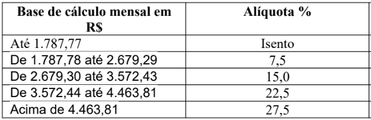
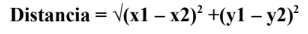

# TADS 2º período - Programação Orientada a Objetos - Avaliação 1º bimestre

INSTITUTO FEDERAL DO TOCANTINS - CAMPUS ARAGUAÍNA

Estudante: Juan Felipe Alves Flores

Professor: Paulo Ricardo Pontes

Curso: Técnico em Análise e Desenvolvimento de Sistemas (2° Período)

Disciplina: Programação Orientada à Objetos

### Questões

#### Questão 1 (1,0 ponto):

Você está desenvolvendo um sistema de biblioteca. Crie uma classe "Livro" com atributos como título, autor e número de cópias disponíveis. Como você usaria métodos para registrar o empréstimo e a devolução de livros por diferentes usuários?

#### Questão 2 (1,0 ponto):

Imagine que você está criando um sistema para gerenciar o estoque de uma loja. Projete uma classe "Produto" com atributos como nome, preço e quantidade em estoque. Como você implementaria métodos para adicionar produtos ao estoque, atualizar preços e exibir informações de produtos?

#### Questão 3 (1,0 ponto):

Desenvolva uma classe chamada "Contato" com atributos como nome, número de telefone e endereço de e-mail. Crie uma classe separada chamada "Agenda" que pode armazenar vários contatos. Como você implementaria métodos para adicionar, excluir e listar contatos na agenda?

#### Questão 4 (1,0 ponto):

Crie uma classe Funcionario que contenha operações que realiza o aumento do salário com base em um percentual e outra operação que calcula o desconto do salário com base na tabela do imposto de renda na imagem abaixo. Crie uma classe principal que faz a validação e testes do dados passados para a classe Funcionário.

#### Questão 5 (1,0 ponto):

Crie uma classe Calculadora que contenha as quatros operações aritméticas. Utilize a sobrecarga de métodos para que operações sejam realizadas com números inteiros e reais. Faça os testes das operações em uma classe principal.

#### Questão 6 (1,0 ponto):

Crie uma classe Ponto que contém um par ordenado (x, y). Em seguida, faça o cálculo da distância entre dois pontos, conforme a fórmula matemática na imagem abaixo:

Data: 23 de outubro de 2023, segunda-feira (2023-10-23).
